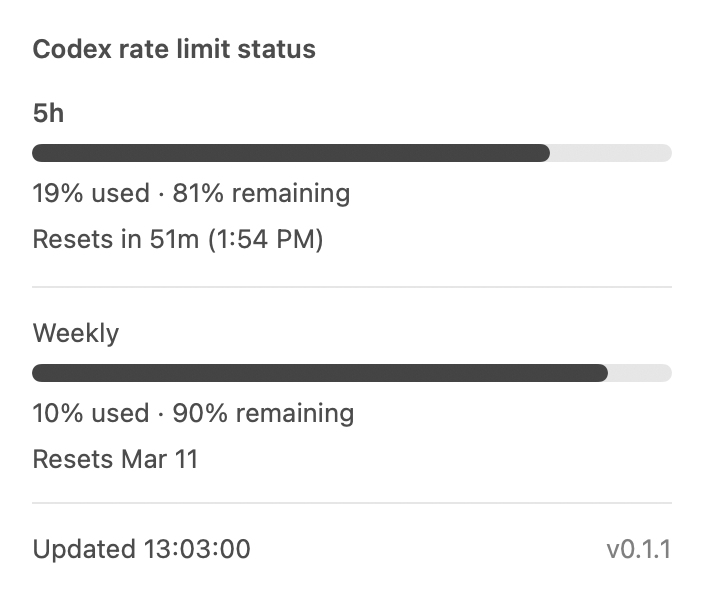
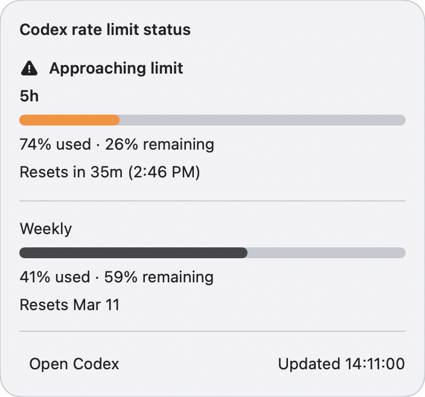
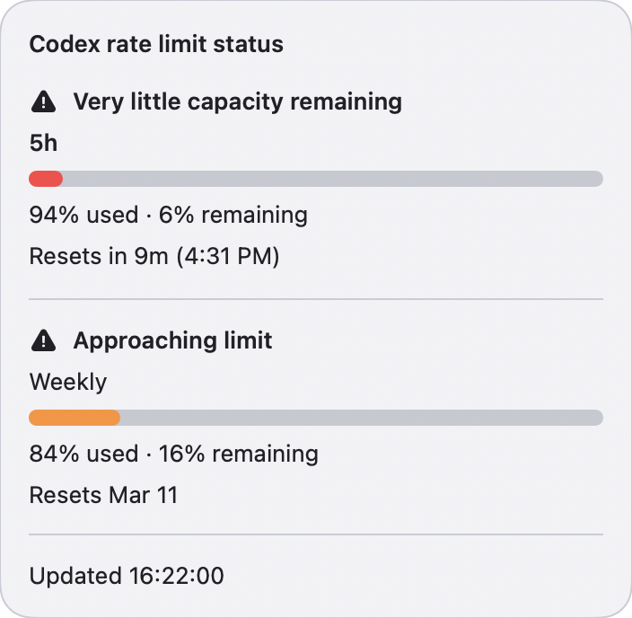

# CodexToolbar

A small macOS menu bar app that shows your Codex rate-limit remaining values.

## What It Does

- Shows the current `5h` remaining percentage in the menu bar.
- Shows a popover with used/remaining percentages, progress bars, and reset timing.
- Refreshes automatically on system clock minute boundaries.
- Supports manual refresh from the menu bar item's right-click menu.
- Can be installed as a real `.app` and configured to launch at login.

## Requirements

- macOS 14+
- Xcode Command Line Tools / Swift toolchain
- Codex installed and signed in on the same Mac

## Install

```bash
git clone https://github.com/mikeylong/codex-toolbar.git
cd codex-toolbar
./scripts/install_app.sh
```

That installs `CodexToolbar.app` to `~/Applications` and opens it.

## Uninstall

```bash
./scripts/uninstall_app.sh
```

That quits `CodexToolbar` if it is running and removes `~/Applications/CodexToolbar.app`.

## Use

- Left-click the menu bar item to see the current rate-limit status panel.
- Right-click the menu bar item for `Refresh now`, `Launch at login`, and `Quit`.
- Use `Launch at login` after running the installed app from `~/Applications`.

## Screenshots

| Normal | Warning | Critical |
| --- | --- | --- |
|  |  |  |

## Notes

- The app launches its own `codex app-server` subprocess. You do not need to keep an interactive Codex CLI session open.
- The displayed percentages are remaining percentages, matching the Codex UI.
- Auto-refresh syncs to system clock minute boundaries, so the numbers update at the start of each minute unless you refresh manually from the right-click menu.

## Development

```bash
swift test
swift run CodexToolbar
./scripts/generate_screenshots.sh
./scripts/smoke_test_install.sh
```

## Fresh Install Smoke Test

Run this from a clean local macOS user account to validate the documented install flow:

```bash
./scripts/smoke_test_install.sh
```

Expected passing outcomes:
- the app installs to `~/Applications`
- the installed app launches successfully
- startup reaches either live ready state, `Codex CLI not found.`, `Sign in to Codex to view rate limits.`, or `No rate-limit data available.`

`Launch at login` should be validated only after the installed app is running from `~/Applications`.
