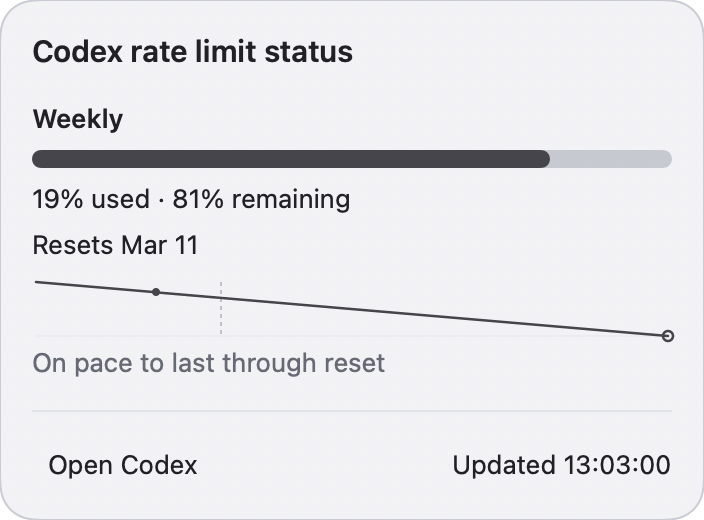
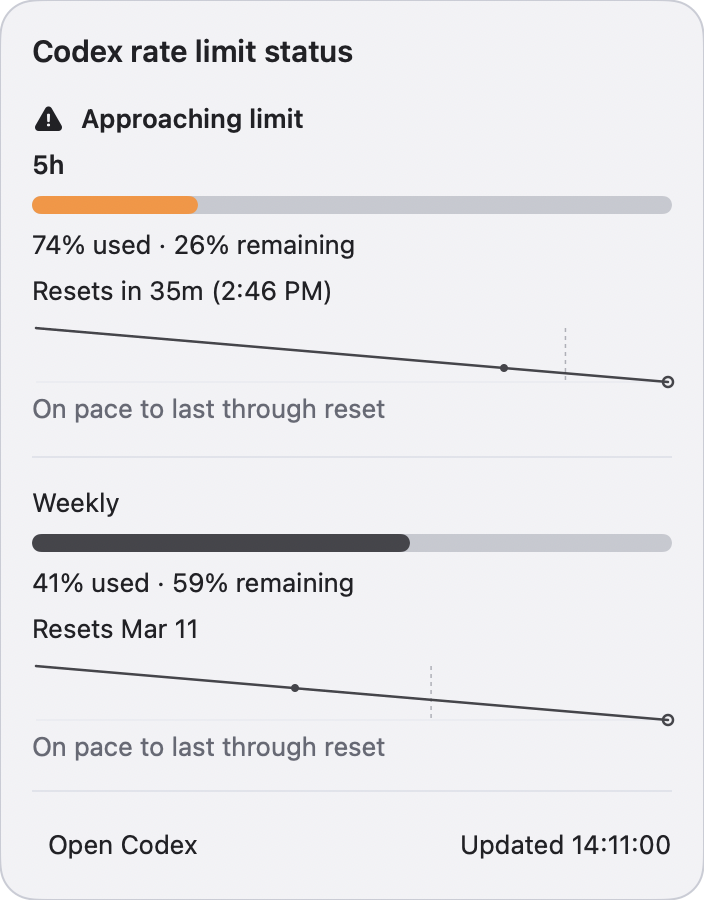
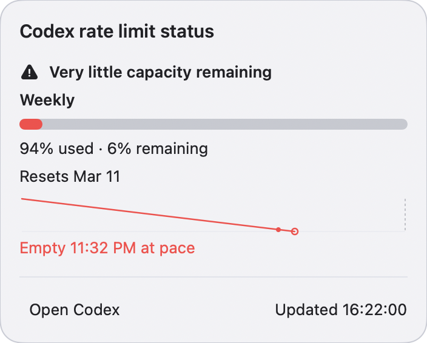
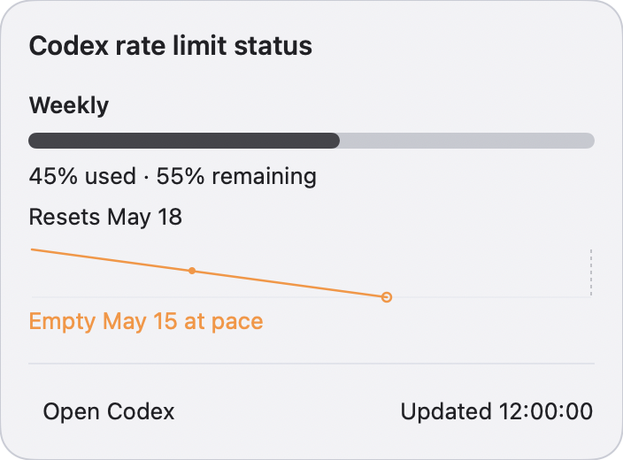
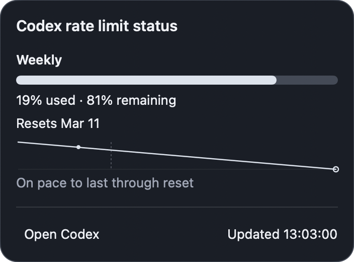
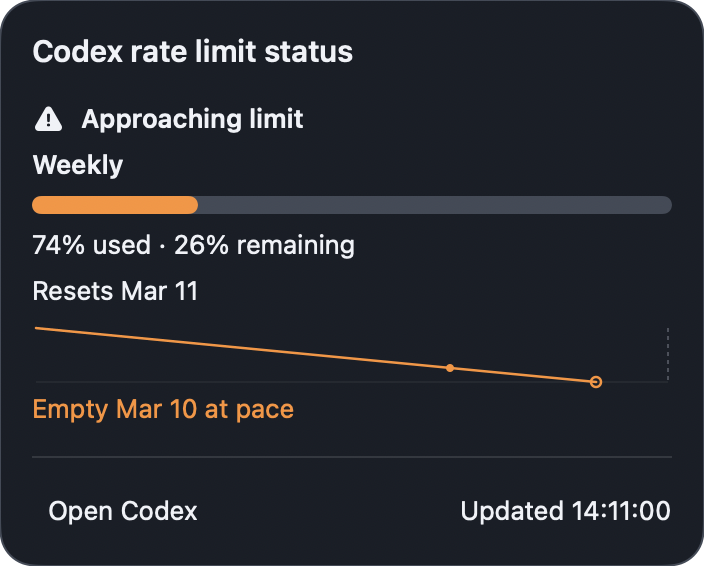
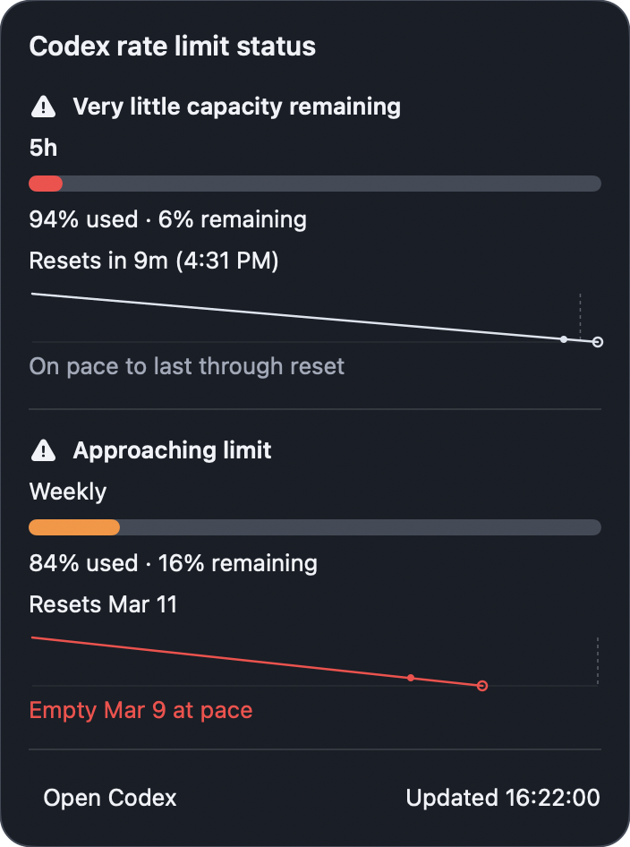
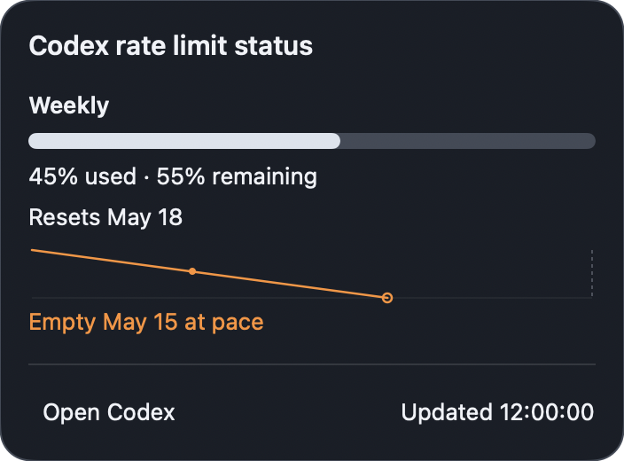

# CodexToolbar

A small macOS menu bar app that shows your Codex rate-limit remaining values.

## What It Does

- Shows a compact progress bar for the most constrained core Codex window in the menu bar, including multi-week windows.
- Shows a popover with used/remaining percentages, progress bars, and reset timing.
- Projects from the current 5h and Weekly pace whether tokens will run out before reset.
- Optionally shows organization-level OpenAI API usage in the popover when you enable the view and configure an `OPENAI_ADMIN_KEY`.
- Adds an `Open Codex` button in the popover when the Codex desktop app is installed.
- Refreshes automatically on system clock minute boundaries.
- Supports manual refresh from the menu bar item's right-click menu.
- Can be installed as a real `.app` and configured to launch at login.

## Requirements

- macOS 14+
- Codex CLI installed locally
- Codex installed and signed in on the same Mac

## Install

### Download DMG

[Download the latest DMG from GitHub Releases](https://github.com/mikeylong/codex-toolbar/releases/latest)

Open the DMG, drag `CodexToolbar.app` into `Applications`, and launch it from there.

### Build from source

Source builds require Xcode Command Line Tools or a full Swift toolchain.

```bash
git clone https://github.com/mikeylong/codex-toolbar.git
cd codex-toolbar
./scripts/install_app.sh
```

That installs `CodexToolbar.app` to `~/Applications` and opens it.

## Uninstall

```bash
./scripts/uninstall_app.sh
```

That quits `CodexToolbar` if it is running, removes its launch-at-login registration, and deletes `~/Applications/CodexToolbar.app`.

## Use

- Left-click the menu bar item to see the current rate-limit status panel.
- Enable `Show API usage` from the right-click menu, then use the OpenAI API usage section in the popover after configuring an `OPENAI_ADMIN_KEY`.
- Use the popover's `Open Codex` button to jump into the Codex desktop app when it is installed locally.
- Right-click the menu bar item for `Refresh now`, `Launch at login`, `Show API usage`, `Configure OpenAI admin key…`, and `Quit`.
- Use `Launch at login` after running the installed app from `~/Applications`.

## Screenshots

| Theme | Normal | Warning | Critical | Projection |
| --- | --- | --- | --- | --- |
| Light |  |  |  |  |
| Dark |  |  |  |  |

## Notes

- The app launches its own `codex app-server` subprocess. You do not need to keep an interactive Codex CLI session open.
- The displayed percentages in the popover are remaining percentages, matching the Codex UI.
- Window labels in the popover follow Codex UI display conventions first, with near-whole hour/day/week payload values normalized as a fallback.
- Auto-refresh syncs to system clock minute boundaries, so the numbers update at the start of each minute unless you refresh manually from the right-click menu.

## Development

```bash
swift test
swift run CodexToolbar
./scripts/build_dmg.sh
./scripts/generate_screenshots.sh
./scripts/smoke_test_install.sh
```

GitHub Actions runs `swift test` plus the installed-app smoke test on macOS for pull requests and pushes to `main`.
Tagged releases also build and upload a signed DMG to GitHub Releases.

Release rule:
- Ship annotated git tags that match `Resources/Info.plist` `CFBundleShortVersionString`, for example `v0.1.10`.
- GitHub release DMGs must be signed with a real `Developer ID Application` identity and stapled after notarization. An ad hoc DMG will trigger the macOS "Apple could not verify it is free of malware" warning when downloaded from GitHub.
- The `Release DMG` workflow expects these repository secrets before a tag is published: `MACOS_DEVELOPER_ID_APPLICATION_P12`, `MACOS_DEVELOPER_ID_APPLICATION_P12_PASSWORD`, `MACOS_BUILD_KEYCHAIN_PASSWORD`, `MACOS_DEVELOPER_ID_APPLICATION_IDENTITY`, `APPLE_API_KEY_P8`, and `APPLE_API_KEY_ID`.
- `APPLE_API_ISSUER_ID` is optional. Set it for a team App Store Connect API key; leave it unset for an individual key.

Local notarized DMG setup:
- Save the App Store Connect API key to disk, for example `~/.keys/AuthKey_<KEY_ID>.p8`, with `chmod 600`.
- Create a reusable local notary profile:

```bash
xcrun notarytool store-credentials codextoolbar-notary \
  --key ~/.keys/AuthKey_<KEY_ID>.p8 \
  --key-id <KEY_ID> \
  --issuer <ISSUER_UUID> \
  --validate
```

- Build and verify a notarized DMG using the installed Developer ID identity:

```bash
CODE_SIGN_IDENTITY='Developer ID Application: Michael Long (2468833C5L)' \
NOTARYTOOL_KEYCHAIN_PROFILE='codextoolbar-notary' \
REQUIRE_DISTRIBUTION_SIGNING=true \
VERIFY_DMG_AFTER_BUILD=true \
./scripts/build_dmg.sh
```

## Troubleshooting

If you move or rename the repo and `swift run CodexToolbar` stops compiling with an error like `PCH was compiled with module cache path ...` plus `missing required module 'SwiftShims'`, clear the stale Swift module cache and rerun:

```bash
swift package clean
swift run CodexToolbar
```

`./scripts/build_app.sh` and `./scripts/install_app.sh` automatically retry once after `swift package clean` when they detect this specific cache-mismatch failure.

## Fresh Install Smoke Test

Run this from a clean local macOS user account to validate the documented install flow:

```bash
./scripts/smoke_test_install.sh
```

Expected passing outcomes:
- the app installs to `~/Applications`
- the installed app launches successfully
- startup reaches either live ready state, `Codex CLI not found.`, `Sign in to Codex to view rate limits.`, or `No rate-limit data available.`

`Launch at login` should be validated only after the installed app is running from `~/Applications`.
